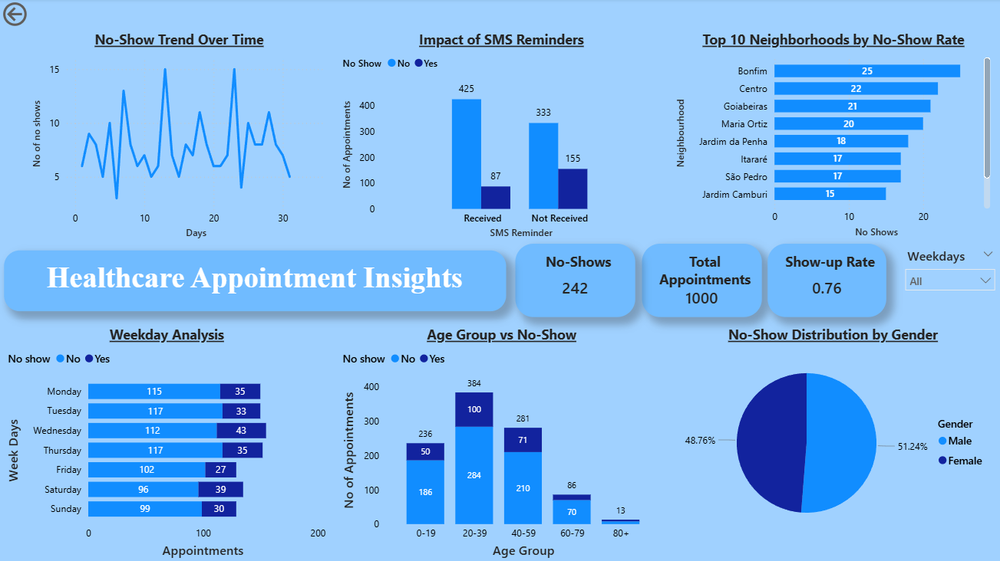

## Project Overview
This project analyzes hospital appointment data to uncover trends, patterns, and factors affecting patient attendance. The analysis was performed using **MySQL** for data querying and transformation, and **Power BI** for interactive visualizations.

The primary objectives of this analysis were to:

* Identify booking patterns by time, demographics, and medical conditions.
* Measure the no-show rate and its influencing factors.
* Compare appointment attendance across different patient groups.
* Provide actionable insights for hospital management to improve patient turnout.

---

## Tools & Technologies

* **Database:** MySQL
* **Visualization:** Power BI
* **Language:** SQL
* **Data Source:** Hospital appointment records

---

## Key Insights

* SMS reminders significantly reduce the no-show rate.
* Certain neighbourhoods account for a higher volume of bookings.
* Older patients tend to have a slightly higher attendance rate.
* Patients with specific medical conditions exhibit distinct booking behaviors.
* Peak booking days occur mid-week, while weekends see fewer appointments.

---

## Dashboard - [Download](Files/appointments_report.pbix)

---

**Click to download** [SQL File](Files/Analysis_of_appointments.sql)

**Click to download** [Project Report](Files/Healthcare_insights.pdf)

## Contact

* **Developed by:** Mohammed Swalih
* **Email:** swalihkichu00@gmail.com
* **LinkedIn:** [Mohammed Swalih](https://www.linkedin.com/in/mohammed-swalih-977b71219/)
